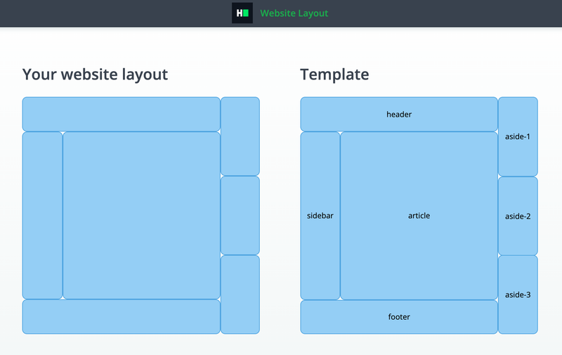

# CSS: Flex website layout
Complete a partially completed application. Complete the application shown below using CSS `flex` rules in order to pass all the unit tests.

## Environment 

- Node Version: ^12.18.3
- Default Port: 8000

## Application Demo:


## Application description

Complete a website layout application with the following UI:

Your website contains following components:
- left container
    - header
    - content
        - sidebar
        - article
    - footer
- right container
    - aside block 1
    - aside block 2
    - aside block 3

Position all components the way described below:
- Use `flex` display for positioning elements
- Hints:
    - Left container takes 4/5 of the parent width
    - Right container takes 1/5 of the parent width
    - Sidebar takes 1/4 of the parent width
    - Article takes 3/4 of the parent width
    - Header takes 1/5 of parent height
    - Footer takes 1/5 of parent height
- Every layout component should be located exactly how it is shown on the template.

All the markup for the question has been added. As a candidate, you have to complete the CSS file to implement the above-stated features.

## Project Specifications

**Read Only Files**
- `test/*`
- `src/index.js`
- `src/index.html`
- `src/css/readonly.css`
- `app.js`

**Commands**
- run: 
```bash
bash bin/env_setup && . $HOME/.nvm/nvm.sh && npm start
```
- install: 
```bash
bash bin/env_setup && . $HOME/.nvm/nvm.sh && npm install
```
- test: 
```bash
bash bin/env_setup && . $HOME/.nvm/nvm.sh && npm test
```
